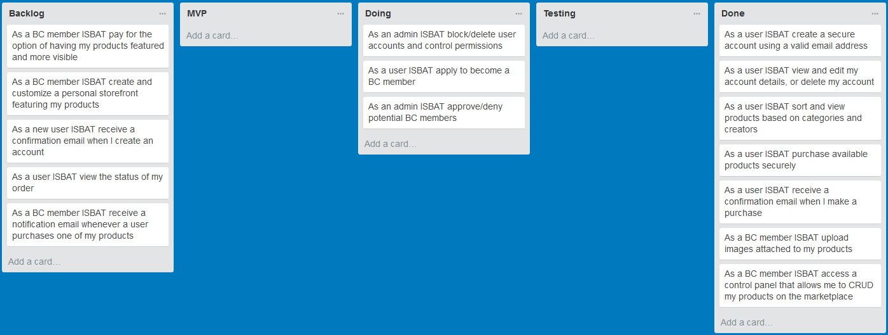
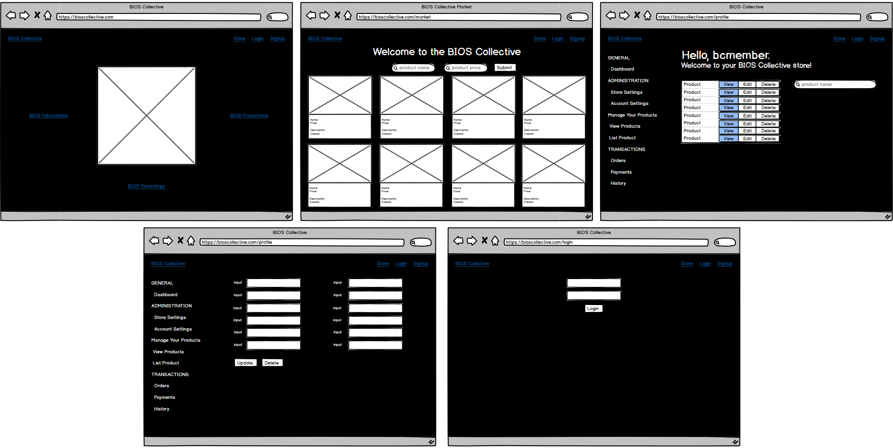
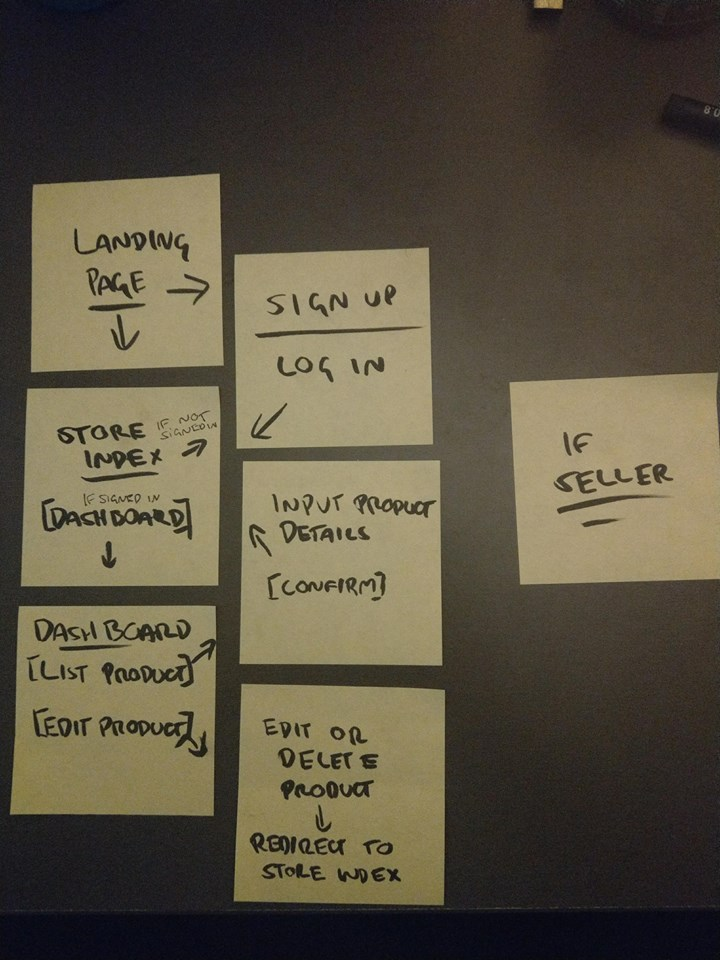
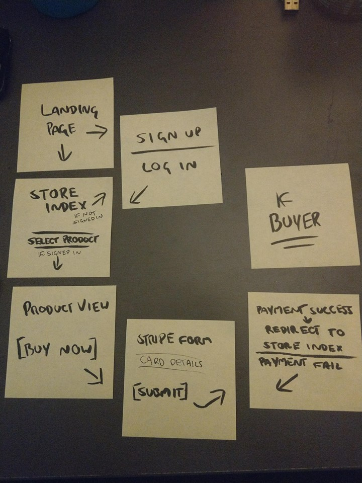
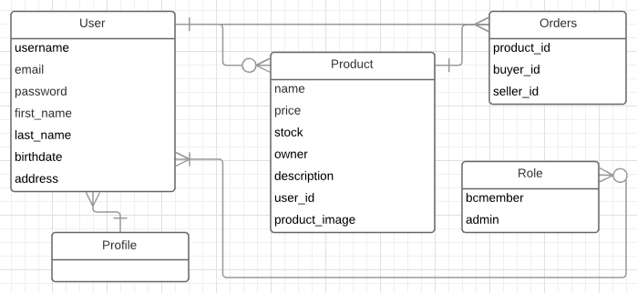

# README
# Overview

1. Summary
2. Installation
3. Requirements
4. User Stories
5. Wireframing
6. Workflow Diagram
7. Entity Relationship Diagram
8. List of Tools Used
9. Future Updates
10. Disclaimer

--------------------

Link: https://bcmarket.herokuapp.com/

*NOTE: Heroku app utilises Stripe test keys, will not process actual payments - all content is for demonstrative purposes only.*

## 1. Summary
This app was designed as part of the CoderAcademy assignment to build a two-sided marketplace. 

*Consider this an MVP until this noticed is removed.*

PROBLEM DEFINITION
With the sheer amount of artists/creators selling their wares online, it is often difficult for people to break into the market and advertise their products in such a way that they are easily discoverable by target audiences, and able to be purchased with minimal effort/interaction involved.

SOLUTION
The BIOS Collective Marketplace, with a focus on Cyberpunk creations, presents a single location where content creators can display and offer their wares, and users can browse and purchase, without the competition of thousands of other stores as found on similar sites such as Etsy & Storenvy.

While marketplaces such as Etsy & Storenvy already offer a similar solution, these options are often difficult to setup & maintain, with various hidden fees and an absolutely overwhelming amount of competition. BIOS Collective Marketplace allows creators to add their products to a singular store with various category options, and allows users to search both products and creators, with simple purchasing options. 

BIOS Collective itself is a collective of artists, photographers, designers and creators with a passion for Cyberpunk design and expression, and has several other facets aside from the BIOS Collective Marketplace, such as:

- BIOS Productions - An event productions group consisting of decor designers, lighting and visual artists, and musical artists/performers
- BIOS Fabrications - A craft commission service, allowing users to commission custom creations from various BIOS Collective Members
- BIOS Recordings  - An independent music label, consisting of music artists and musicians within BIOS Collective

The BIOS Collective Marketplace provides a singular destination that caters to many products of these groups, with members able to list musical releases, photo prints, physical & digital art, and more.

--------------------

## 2. Installation
Configuration - you will not have an ENV file as this has been ignored through Git. In order to run the App you will need to create a .env file with your own sendgrid and stripe API keys, as well as PostgreSQL credentials.
1. Clone the repo and cd into the directory.
2. Run 'bundle install' in the terminal.
3. Run 'rails db:migrate' in the terminal.
4. Create a '.env' file in the root of the directory, and add necessary ENV variables with the following syntax:
   - 'STRIPE_API_PUBLISHABLE_KEY=XXXX'
   - 'STRIPE_API_SECRET_KEY=XXXX'
   - 'SENDGRID_USERNAME=XXXX'
   - 'SENDGRID_PASSWORD=XXXX'
   - 'POSTGRES_PASSWORD=XXXX'

--------------------

## 3. Requirements

1. Create your application using Ruby on Rails.
2. Demonstrate knowledge of Rails conventions.
3. Use postgresql database in development.
4. Use an API (e.g. Omniauth, Geocoding, Maps, etc).
5. Use appropriate gems.
6. Use environmental variables to protect API keys etc. (dotenv)
7. Implement a payment system for your product. (e.g. Stripe)
8. Your app must send transactional emails (eg. using Mailgun).
9. Your app will have some type of searching, sorting and/or filtering capability.
10. Your app will have some type of file uploading capability (eg. images).
11. Your app will have authentication (eg. Devise, must have full functionality in place).
12. Your app will have authorisation (users have restrictions on what they can see and edit).
13. Document your application with a README that includes,
    - Link to your deployed application;
    - Link to your GitHub repository;
    - Explains how to setup, configure and use your application.

### Optional features

1. Implement an internal user messaging system within your app.
2. Implement an admin dashboard for the admin user to administer the site.

--------------------
## 4. User Stories

--------------------
## 5. Wireframing

--------------------
## 6. Workflow Diagram

--------------------
## 7. Entity Relationship Diagram

--------------------
## 8. List of Tools Used
1. Github - Version control
2. Lucidchart - ERD
3. PostgreSQL - Database
4. Devise - Authentication
5. Heroku - Webhost
6. Sendgrid - Transactional emails
7. Stripe API - Payment system
8. Stripe Elements.js - Strip integration and styling
9. ABalsamiq - Wireframing
10. Carrierwave - Image uploads
11. Dotenv-rails - ENV variables
12. Bulma - CSS Framework
13. Rolify - User roles

--------------------
## 9. Bugs/Future Updates
1. Updating user details via profile not functional
2. Stripe creates duplicate customers even when user already has a customer_id
3. Email functionality currently disabled due to Sendgrid account suspension

1. Admin control panel, allowing admins to moderate products and user accounts, as well as promote users to members
2. Order tracking and history for member sales
3. Convert Stripe integration to create 'orders' rather than 'charges'
4. Extend filtering functionality
5. Create shop pages for each member, with some degree of customization, listing all products listed by the member
6. Add links to BIOS Fabrications & BIOS Productions websites to landing page
7. Styling and responsiveness

--------------------
## 10. Disclaimer
This is far from a finished product. Over the course of development I have learned a great deal and have come to notice many errors and poor practices in my development procedures, and ultimately plan on re-creating this application from the ground up, taking advantage of what I have learnt. Whilst the application in its' current state is functional and (mostly) solves the stated problem, overall I am not happy with the state of the application and will be focusing my future efforts on a fresh design, rather than refactoring and cleaning up the current application. As such, there is a great deal of redundant/unused code in this repo which I have decided to keep as a reference for future projects, and as a little reminder of what not to do! To support this, I plan on going through the core code and commenting upon various sections, making note of the intention and any issues/solutions that presented themselves throughout development.